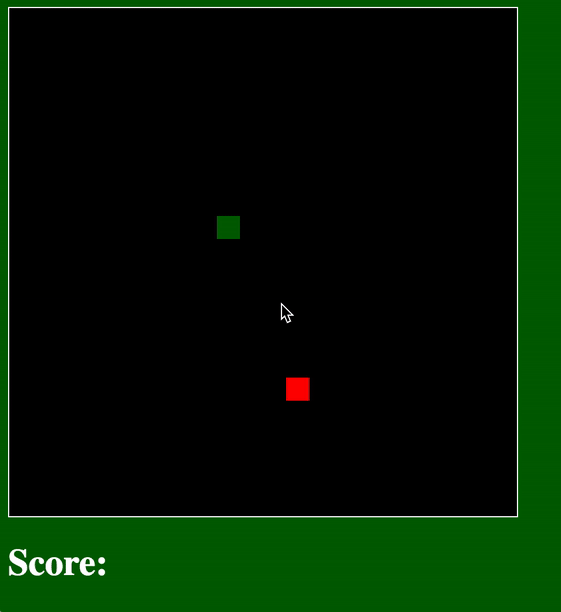
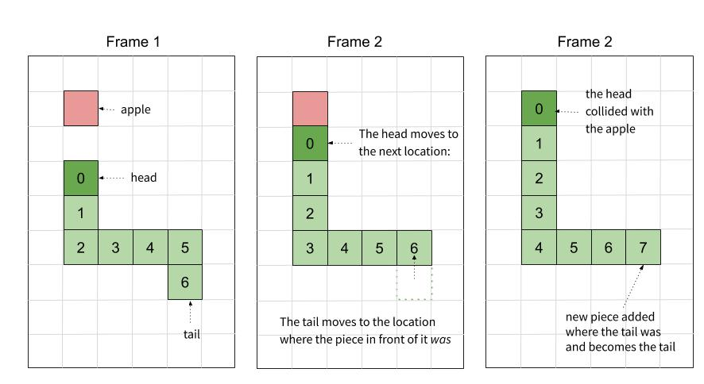

# Snake
Building Snake from scratch in Advanced Software Development.  

**Table of Contents**
- [Setup](#setup)
- [Skills Practiced](#skills-practiced)
- [Worksheet](#worksheet)
- [Requirements](#requirements)
- [Plan of Attack](#plan-of-attack)

<a href="https://benspector3.github.io/projects/snake/index.html" target="_blank"> Play the demo! (Right Click --> Open in new tab) </a>



# Setup

To install this project, first clone the [template](https://github.com/benspector3/asd-template/) repository by entering these commands into your bash terminal:

```bash
git clone https://github.com/benspector3/asd-template.git
rm -rf asd-template/.git
```

Then, rename the folder to `snake`

# Skills Practiced
- Separation of Concerns and Abstraction
- Keeping code organized between `initialization`, `core logic`, `helper functions` and `event handler` sections
- Controlling DOM elements with jQuery
- Managing data for DOM elements with Objects and Factory Function
- Managing a collection of Objects with an Array
- Iteration
- Initializing new DOM elements with jQuery

# Worksheet

Before beginning, complete the <a href="https://drive.google.com/open?id=1h9DBLktvwVCODaAn4vg5FKnbkbyYjLIMik5IMYMbhY0" target="_blank"> Snake Worksheet </a>



# Requirements

## The Board
**1) Think of the board as a 2-D grid of 20 pixel * 20 pixel squares.** 

For example If the board is `440` pixels wide and `440` pixels tall:
  - 22 columns along the x-axis
  - 22 rows along the y-axis
  
**2) Game items (the apple, each piece of the snake) must be positioned in intervals of 20 pixels.** 

For example, consider the conversions below:
```
snakeHeadColumn = 5;
snakeHeadX = 20 * snakeHeadColumn = 100

snakeHeadRow = 10;
snakeHeadY = 20 * snakeHeadRow = 200
```

## The Snake

**1) Each component of the snake must be an `{ Object }`**

**2) The entire snake's body must be represented as an `[Array]` of these `{Object}`s**
  - The first object in the Array is the "head" of the snake

**3) When the snake collides with the apple:**
  - A new DOM element is created and added to the board using jQuery.
  - A new snake `{Object}` is created and added to the snake `[Array]`
  
**4) The snake's head must continously move in 20 pixel intervals**
  - The head can move along either the x-axis (horizontally) or the y-axis (vertically), but never both (diagonally)
  - The user controls when the snake's head changes direction
  - The 2nd snake object follow the head, the 3rd follows the 2nd, etc… 

## The Apple
**1) The apple must be an `{Object}`**

**2) The apple's location is determined randomly and must be in an unoccupied, valid position.**
- valid: the apple's x/y coordinate must be a multiple of 20
- unoccupied: any part of the snake cannot already be there

**3) Each time the snake collides with the apple, the apple is moved to a new, random, unoccupied, and valid location**

**4) The number of apples eaten must be displayed**

# Plan of Attack
1. Get the Snake's head to appear on the screen
2. Move the snake continously. Limit movement to one axis at a time (horizontal/vertical movement, never diagonal)
3. Change direction according to keyboard inputs from the user.
4. Detect collisions between the snake's head and the wall
5. Get the Apple to appear on the screen
6. Position the apple randomly
7. Detect collision between the apple and the snake's head
8. Reposition the apple upon colliding with the snake.
9. Add a new snake piece upon colliding with the apple.
10. Make the new snake pieces follow the snake's head
11. Detect collision between the snake's head and the rest of its body
12. Keep track of and display the score

